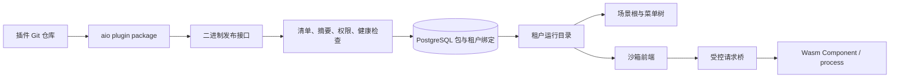

# aio-idea / AIO Idea

- [宿主界面重构设计与验收（中文）](docs/ui-refactor/README.md) / [Host UI refactor design & acceptance (Chinese)](docs/ui-refactor/README.md)

这是基于 [aio-platform](https://github.com/zjarlin/aio-platform) 组装的应用产品和官方插件中心。系统引导能力来自 Cargo 中锁定完整提交 SHA 的独立插件仓库；`aio.toml` 定义默认租户首次启动时安装的运行时 Git 组合。活动版本、租户绑定、市场元数据和完整 `.aio-plugin` 二进制包保存在 PostgreSQL，本地版本目录只是可恢复的运行缓存。

This is the assembled application product and official plugin center built on [aio-platform](https://github.com/zjarlin/aio-platform). Bootstrap capability comes from separate plugin repositories locked to full commit SHAs in Cargo; `aio.toml` defines the runtime Git composition installed when the default tenant first starts. Active versions, tenant bindings, marketplace metadata and complete `.aio-plugin` binary packages are stored in PostgreSQL; the local version directory is only a recoverable runtime cache.

插件本地开发使用 `aio plugin dev .`，由平台提供的独立宿主加载未提交代码及必需依赖；无需克隆或编译本产品，也不需要 push。完整步骤见 [平台开发沙箱](https://github.com/zjarlin/aio-platform/blob/main/docs/development/README.md)。

Local plugin development uses `aio plugin dev .`: a standalone host provided by the platform loads uncommitted code and required dependencies. There is no need to clone or build this product, and no push required. Full steps are in the [平台开发沙箱](https://github.com/zjarlin/aio-platform/blob/main/docs/development/README.md) (platform development sandbox).

生产发布由 `aio-platform/delivery` 的独立构建服务发现带发布标记的公开仓库，跟踪默认分支并完成构建、验证和租户升级，不依赖 GitHub Actions。手工二进制发布继续用于受控发布场景。安装、实例监督、资源服务、通信桥和通用浏览器壳均归 `az-plugin-host`；本产品只装配身份、品牌、系统页面、默认组合及生产部署配置。

Production releases are handled by the standalone build service in `aio-platform/delivery`: it discovers public repositories carrying release markers, tracks their default branch and performs build, verification and tenant upgrades — without depending on GitHub Actions. Manual binary releases remain for controlled release scenarios. Installation, instance supervision, resource services, the communication bridge and the generic browser shell all belong to `az-plugin-host`; this product only assembles identity, branding, system pages, the default composition and production deployment configuration.

当前包协议为格式 2，CLI 与宿主使用同一固定提交的共享验证库。一个包可以同时包含 `plugin.frontend` 静态资源与 Wasm Component 或 process 后端。页面用 `PageDefinition.body.kind = frontend` 声明入口；宿主为当前用户、租户、页面和活动版本签发短期挂载票据，并在不含 `allow-same-origin` 的沙箱 iframe 中加载。浏览器请求只能经受控桥调用清单声明的后端路由，停用、卸载、回滚、切换租户或会话失效都会撤销旧票据。[Dioxus 全栈示例](https://github.com/zjarlin/aio-plugin-dioxus-fullstack) 已覆盖同仓前端、后端和共享模型。

The current package protocol is format 2; the CLI and host share one shared verification library pinned to a fixed commit. One package can contain both `plugin.frontend` static assets and a Wasm Component or process backend. Pages declare their entry via `PageDefinition.body.kind = frontend`; the host issues short-lived mount tickets for the current user, tenant, page and active version, and loads them in sandboxed iframes without `allow-same-origin`. Browser requests may only call manifest-declared backend routes through the controlled bridge; disable, uninstall, rollback, tenant switch or session expiry all revoke old tickets. The [Dioxus 全栈示例](https://github.com/zjarlin/aio-plugin-dioxus-fullstack) (Dioxus full-stack example) covers frontend, backend and shared models in one repository.

插件开发先让 AI 阅读 aio-platform 仓库的 `aio-plugin-development` Skill 和对应语言规约。前端、后端、共享逻辑和子插件属于同一个功能仓库。

For plugin development, first have the AI read the `aio-plugin-development` Skill and the corresponding language conventions in the aio-platform repository. Frontend, backend, shared logic and sub-plugins belong to the same feature repository.

顶部场景选择当前菜单树的根，侧栏只显示当前场景的业务菜单。账户插件贡献的个人资料、设置、市场和租户切换页面从左下角进入独立全屏视图，点击“返回主后台”后保留原场景、页面及页面内部状态；账户页面不会重复出现在侧栏。此规则由共享壳处理，也适用于运行时子插件贡献的账户页面。

The top scenario selector is the root of the current menu tree; the sidebar only shows the business menus of the current scenario. Profile, settings, marketplace and tenant-switching pages contributed by account plugins open as independent full-screen views from the bottom-left; clicking “返回主后台” (Back to main console) preserves the original scenario, page and in-page state, and account pages never repeat in the sidebar. This rule is handled by the shared shell and also applies to account pages contributed by runtime sub-plugins.

页面首次访问才挂载，菜单切换只隐藏旧页面。共享壳默认保留最近访问的 6 个后台页面和 2 个账户页面，不移动已挂载 iframe；缓存内切回会保留 Compose/JS 状态，无需重新申请票据或下载资源。超出容量淘汰非当前最久未访问页面，淘汰后重新打开仍是冷加载。目录每 30 秒以及窗口重新聚焦时刷新；版本、激活代次或页面权限变化会销毁对应缓存，会话、租户或用户权限变化会重建整个页面池。后端每次请求仍即时鉴权，前端目录刷新不是安全边界。

Pages mount on first access; menu switches only hide the old page. The shared shell keeps the 6 most recently visited console pages and 2 account pages by default, without moving mounted iframes; switching back within the cache preserves Compose/JS state, requiring no new tickets or asset downloads. When capacity is exceeded, the least-recently-visited non-current page is evicted; reopening it after eviction is a cold load. The catalog refreshes every 30 seconds and on window refocus; version, activation-generation or page-permission changes destroy the corresponding cache, while session, tenant or user-permission changes rebuild the whole page pool. Every backend request is still authorized immediately — the frontend catalog refresh is not a security boundary.

当前默认系统树由独立插件仓库共同贡献，目录节点本身不是业务页面：

The current default system tree is contributed by independent plugin repositories; the catalog nodes themselves are not business pages:

```text
系统
├── 系统管理
│   ├── 用户管理        aio-plugin-rbac
│   ├── 角色管理        aio-plugin-rbac
│   └── 字典管理        aio-plugin-dictionary
└── 基础设施
    └── 文件管理
        └── 文件列表    aio-plugin-file
```

静态 Rust 系统插件以完整 Git SHA 锁定并通过 Dill `TypeId` 装配；在线插件则由数据库中的租户活动组合聚合。二者最终都转换为相同的场景、`menu_path` 和页面模型，壳不按标题硬编码目录。

Static Rust system plugins are locked to full Git SHAs and assembled via Dill `TypeId`; online plugins are aggregated from the tenant's active composition in the database. Both ultimately resolve to the same scenario, `menu_path` and page models — the shell never hard-codes the catalog by title.



```bash
git submodule update --init --recursive
dx serve
cargo run --no-default-features --features desktop
cargo run --no-default-features --features server
aio plugin install <git>
aio plugin sync
```

`lib/dioxus-admin-workbench` 以 Git 子模块锁定完整版本，Cargo patch 将产品和静态扩展的基础 UI crates 统一到该版本，避免同名不同源码依赖造成 Rust 类型不一致。它是基础库，不是运行时业务插件；CI、容器构建前必须初始化子模块。

`lib/dioxus-admin-workbench` is pinned as a Git submodule to a full version; a Cargo patch unifies the base UI crates of the product and its static extensions onto that version, preventing Rust type mismatches from same-name/different-source dependencies. It is a base library, not a runtime business plugin; CI and container builds must initialize the submodule first.

252 生产发布使用 [发布脚本和服务单元](deploy/252/README.md)，由独立进程监督器管理隔离容器，Cloudflare Tunnel 或反向代理提供公网入口。`compose.yaml` 仅是应用容器构建入口，尚未装配监督器 socket、共享缓存和受限运行网络，不能单独作为完整插件宿主启动。

The 252 production release uses the [发布脚本和服务单元](deploy/252/README.md) (release scripts and service units), where a standalone process supervisor manages isolated containers and a Cloudflare Tunnel or reverse proxy provides the public entry. `compose.yaml` is only the app-container build entry — it does not yet wire the supervisor socket, shared caches or the restricted runtime network, and cannot be started alone as a complete plugin host.
