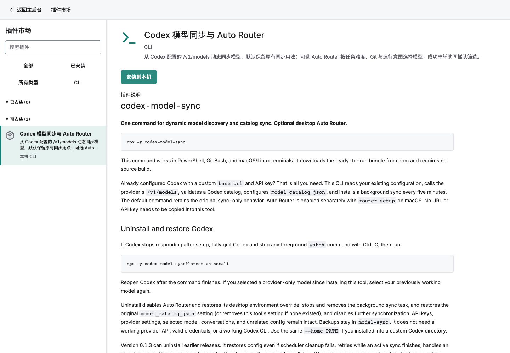
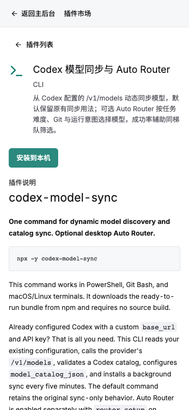

# CLI 插件市场验收

## 2026-09-15 线上上架

[线上 AIO](https://aio.addzero.site) 已部署 CLI 市场，刷新页面后进入 **插件市场 → CLI**，搜索 **Codex 模型同步与 Auto Router** 即可看到 `codex-model-sync 0.4.1`。点击 **安装到本机** 使用 `aio://install/codex-model-sync?version=0.4.1`；首次使用按详情页说明安装 AIO Helper，也可直接在终端执行：

```sh
npx -y @zjarlin/aio tool install codex-model-sync --version 0.4.1
```

安装固定使用 npm 0.4.1 并执行 `setup`，默认仅同步模型和注册后台任务，兼容原来的 `npx -y codex-model-sync` 用法。需要 Auto Router 时在 macOS 本机另行执行 `npx -y codex-model-sync router setup`，完成后完全退出并重新打开 Codex。模型从本机 Codex 配置的 `/v1/models` 动态获取；详细配置见市场内读取的项目 README。

此次宿主发布提交为 `83afd7b0a590ecc8160eea7576a6baa87929427e`，共享平台提交为 `ba4cc584111ba00066e6eac2acc15f64b18c895f`。此前线上仍是 `1c9fc15`，没有 CLI 市场接口；本次同时交付宿主与市场前端。发布前已备份宿主数据库、插件数据库和密钥目录。

验证已完成：

- `az-tool` 的 9 项测试，以及隔离 PostgreSQL 下的重复导入、SemVer 选择和版本不可变验证通过。
- 发布器的服务端测试、Web 检查、glibc 2.17 服务端构建和 Web 构建通过；当前 release、服务进程与公网健康检查一致。
- 实际构建前端的 CLI 市场回归覆盖桌面和手机、命令登记、README、资料编辑及本机协议链接。
- 公网健康检查和 `GET /api/runtime/tools/codex-model-sync/0.4.1` 均返回 HTTP 200。真实登录后的桌面和手机页面显示 0.4.1 条目、仓库 README 和正确安装链接，无横向溢出或页面脚本错误。

[线上浏览器报告](live-report.json) 中的安装点击由测试拦截，仅验证 URI；没有执行本机安装，也没有向宿主提交插件安装请求。





## 本地测试夹具

CLI 与普通插件共用市场列表，使用 CLI 类型筛选。安装按钮生成 `aio://install/codex-model-sync?version=0.1.4`，不调用宿主安装接口。原插件即使具有 cli 标签也不会变成本机执行条目。

已完成桌面和手机实际构建页面的浏览器验证，包括类型筛选、平台切换、精确 URI、卸载说明、无宿主安装请求和无横向页面溢出。截图使用测试数据和实际编译前端，不代表线上已部署。


```sh
dx build --platform web --release
node tests/browser/cli-marketplace.cjs
```

测试需要 playwright；非默认构建目录通过 AIO_WEB_ROOT 指定。


## 命令录入与 README

新增「添加 CLI」弹窗：安装命令必填，Git 地址可选。自动填写标题和备注，保存后可继续修改。适用系统默认识别本机，可在高级项补充检测和卸载命令。默认「保存并安装」在登记后发出 aio:// 请求，也支持仅保存。

新增浏览器验收涵盖两种宽度下的命令录入、可选 Git、README 和相对链接、标题备注编辑、刷新说明、无卸载命令提示以及保存后自动发出的系统协议 URI。自动唤起测试由无头浏览器捕获协议请求，不执行真实软件安装，也不代替系统弹窗人工验收。


