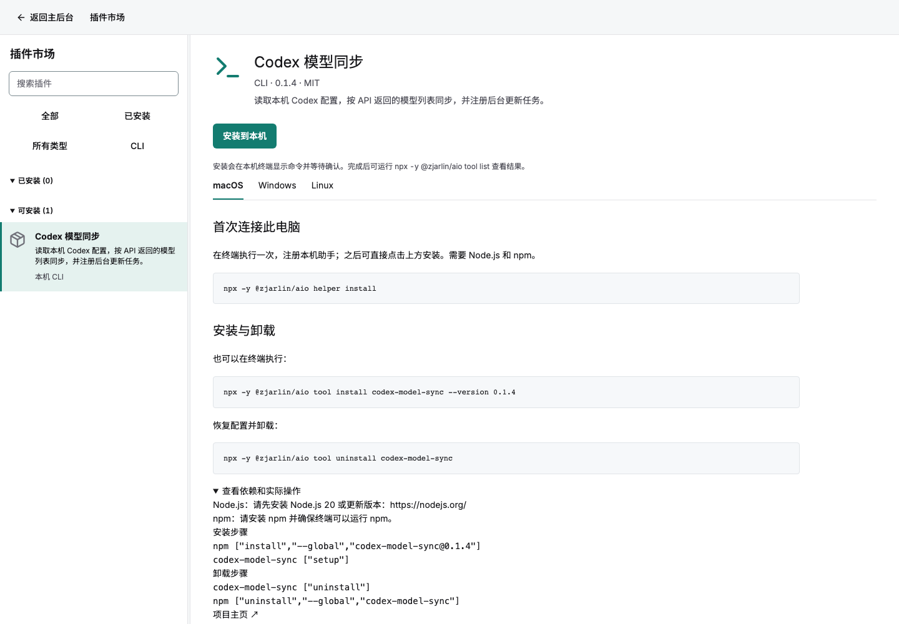
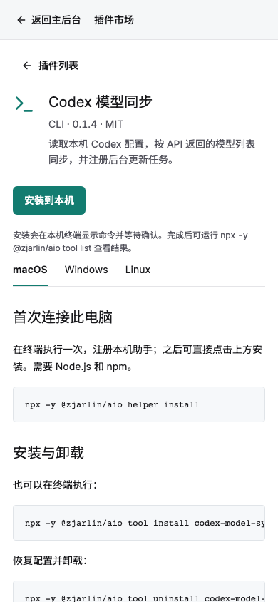
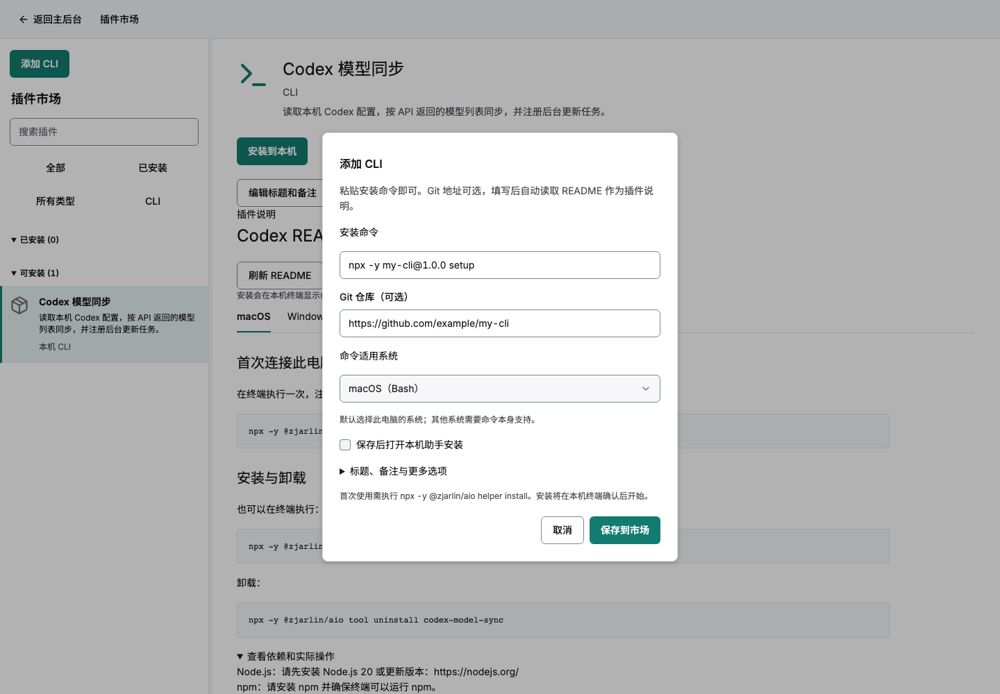
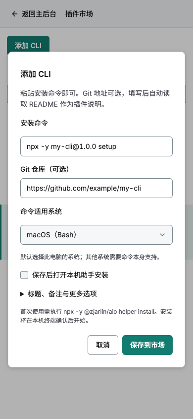
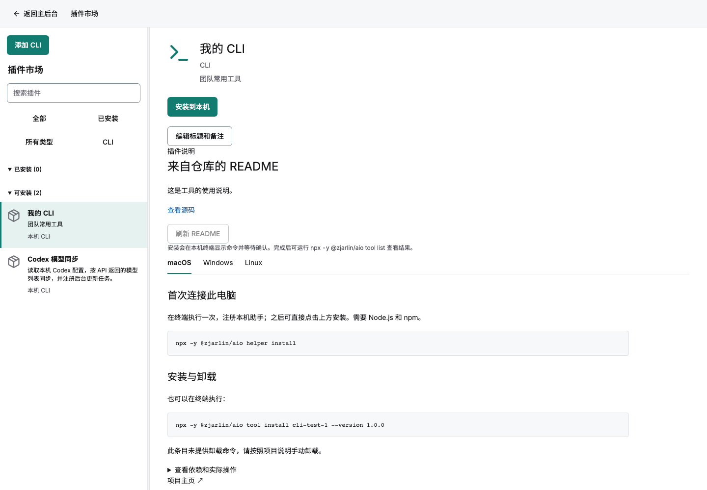
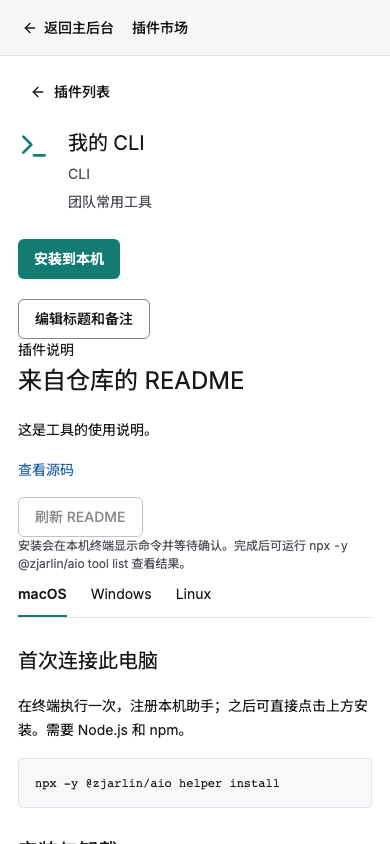

# CLI 插件市场验收

CLI 与普通插件共用市场列表，使用 CLI 类型筛选。安装按钮生成 `aio://install/codex-model-sync?version=0.1.4`，不调用宿主安装接口。原插件即使具有 cli 标签也不会变成本机执行条目。

已完成桌面和手机实际构建页面的浏览器验证，包括类型筛选、平台切换、精确 URI、卸载说明、无宿主安装请求和无横向页面溢出。截图使用测试数据和实际编译前端，不代表线上已部署。





```sh
dx build --platform web --release
node tests/browser/cli-marketplace.cjs
```

测试需要 playwright；非默认构建目录通过 AIO_WEB_ROOT 指定。


## 命令录入与 README

新增「添加 CLI」弹窗：安装命令必填，Git 地址可选。自动填写标题和备注，保存后可继续修改。适用系统默认识别本机，可在高级项补充检测和卸载命令。默认「保存并安装」在登记后发出 aio:// 请求，也支持仅保存。

新增浏览器验收涵盖两种宽度下的命令录入、可选 Git、README 和相对链接、标题备注编辑、刷新说明、无卸载命令提示以及保存后自动发出的系统协议 URI。自动唤起测试由无头浏览器捕获协议请求，不执行真实软件安装，也不代替系统弹窗人工验收。








