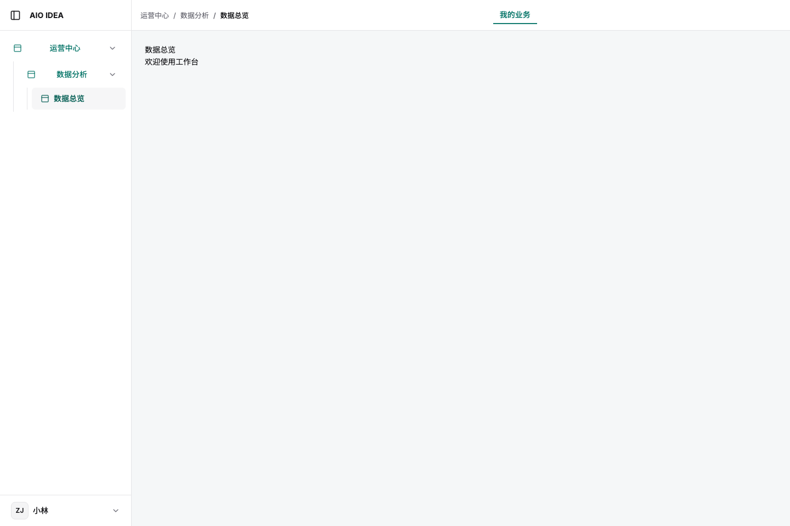
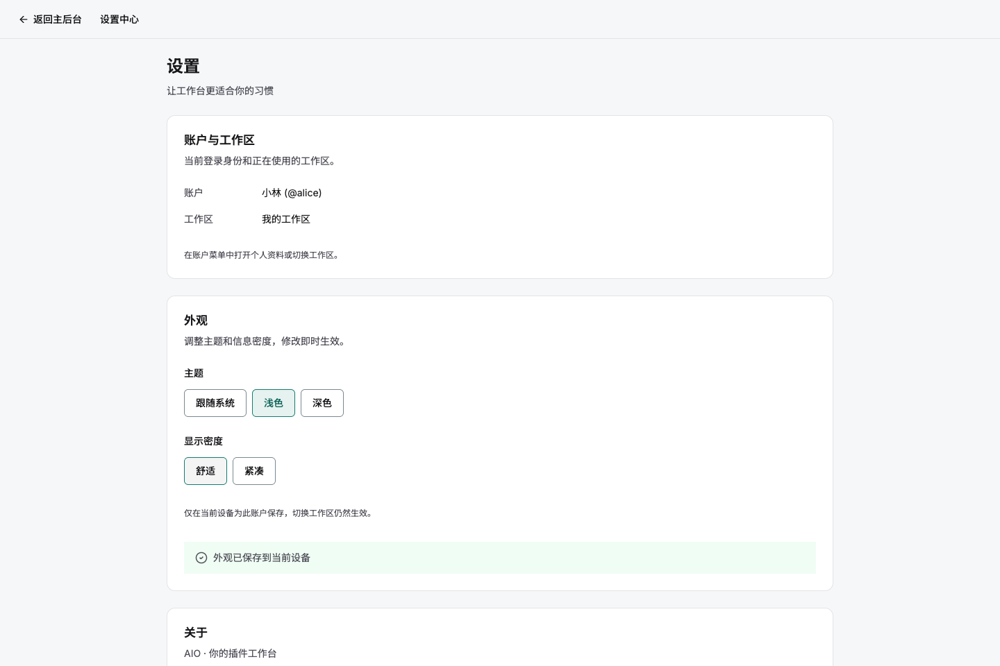
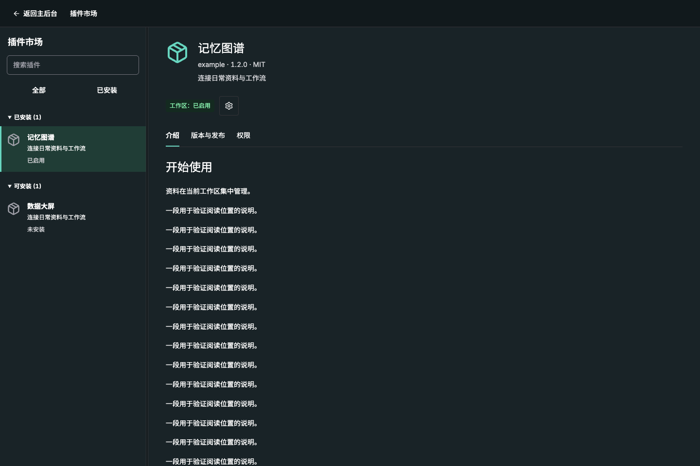
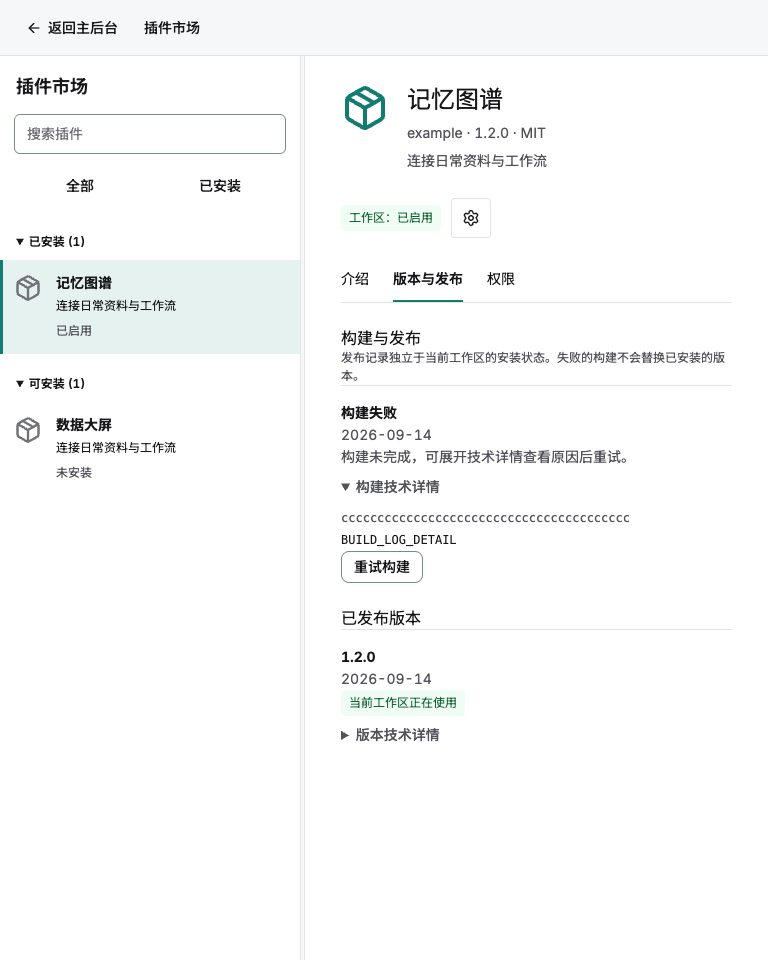
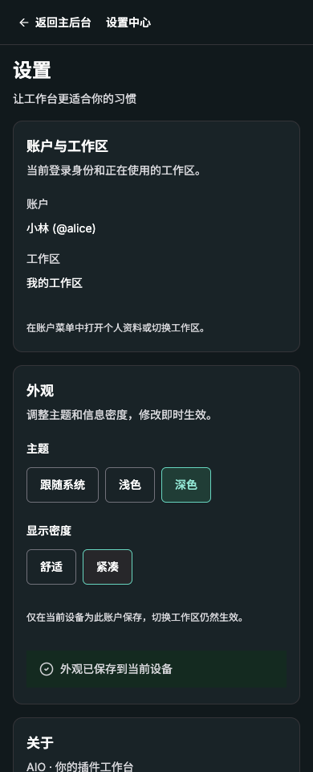
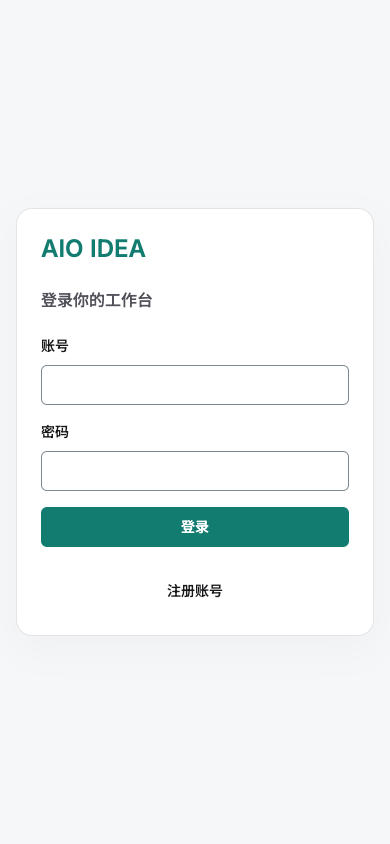

# AIO 宿主界面重构

## 使用目标

AIO 只提供官方插件市场。配置的发布账号下，符合发现规则且构建发布成功的插件自动上架，用户无需填写市场源。普通 Git 推送需要经过发现、构建和校验，才会出现在市场。

本次统一登录、导航、账户、设置、插件市场和公共页面；插件内部 Compose 页面继续由各插件维护。设计与样式归属共享工作台，宿主只组装数据、身份和业务回调。

已完成本地实现与页面验证，交付状态和复现命令见 [验证记录](validation.md)，浏览器结构化结果见 [verification.json](verification.json)。共享宿主的运行时抽取仍是未提交的并行工作，本次不将其直接混入主分支；当前页面截图不表示正式站点已经更新。

## 导航与页面结构

保留插件声明的顶部场景和 `children` 多级菜单，不强制归入“社区插件”。顶部路径展示当前页面及父级，侧栏突出当前分支。账户菜单统一进入资料、工作区、设置和市场，返回时保留原页面及滚动状态。

桌面示意：

```text
┌──────────────┬────────────────────────────────────────┐
│ AIO IDEA     │ 运营中心 / 数据分析 / 数据大屏  我的业务 │
├──────────────┼────────────────────────────────────────┤
│ 运营中心     │                                        │
│   数据分析   │            当前业务页面                │
│   › 数据大屏 │                                        │
│              │                                        │
│ 账户 ▾       │                                        │
└──────────────┴────────────────────────────────────────┘
┌───────────────────────────────────────────────────────┐
│ ← 返回主后台                              插件市场    │
├──────────────────┬────────────────────────────────────┤
│ 插件市场         │ 插件名称 · 作者 · 版本              │
│ 搜索插件         │ 简介                 [安装 / 启用] │
│ 全部 / 已安装    │ 介绍 | 版本与发布 | 权限            │
│ 插件列表与状态   │ README / 发布记录 / 能力说明        │
└──────────────────┴────────────────────────────────────┘
```

移动端示意：

```text
┌─────────────────────┐   ┌─────────────────────┐
│ ← 返回    插件市场  │   │ ← 插件列表          │
│ 搜索插件            │ → │ 名称、简介、版本    │
│ 全部 / 已安装       │   │ [安装 / 启用] 管理  │
│ 插件名称            │   │ 介绍  版本与发布    │
│ 简介 · 状态         │   │ 插件详情            │
└─────────────────────┘   └─────────────────────┘
```

桌面侧栏可收起，移动端用抽屉，选择页面后关闭；场景横向滚动。宿主页面只保留一个主标题，不干涉插件内部标题。

## 设置、市场与反馈

- 设置分为账户与工作区、外观、关于。租户 ID、权限编码等收进“技术详情”。删除市场源表格、弹窗和请求。
- 外观提供浅色、深色、跟随系统及舒适、紧凑密度；默认跟随系统、舒适。偏好按当前设备与用户隔离，即时应用，重新登录保留，不新增同步接口。
- 市场采用桌面列表/详情、移动端列表进入详情。搜索与“全部 / 已安装”筛选保留状态；后台刷新不清空已有内容，不重建详情滚动容器。
- 详情包含介绍、版本与发布、权限。中文显示构建状态，失败先显示摘要，原始日志和提交哈希折叠。工作区安装状态与发布状态分开。
- 主操作为安装、启用或已启用；停用、回退、卸载放入管理菜单，卸载需要确认。
- 空市场、没有搜索结果、无权限、请求失败、首次加载分别处理；错误可重试，成功有反馈。

## 视觉与公共组件

中性浅灰背景、清晰表面、轻边框、青绿色主色；语义状态色独立。正文 14–16px，标题 24px，章节 16–18px；间距 4/8/12/16/24/32px。常规控件高 40px，触摸点击区至少 44px；账户与设置最大宽度 960px。

主题、密度、骨架屏、空状态、反馈及布局由 `dioxus-admin-workbench` 统一提供。偏好模型不依赖 UI，浏览器持久化位于 UI 适配层。保留插件预热、缓存、iframe 挂载和租户/权限失效策略。

## 官方市场与迁移

市场只合并官方已发布记录、Component 记录和当前工作区已安装条目。移除 `/api/runtime/registries`、源管理 DTO、远程索引同步、`marketplace_sources`、`AIO_MARKETPLACE_URL` 和仅生成索引的 CLI 命令。

CLI 初始化、构建、打包、发布及官方仓库发现继续保留。迁移先在同一事务中备份第三方配置与缓存，再清理旧表及第三方索引；不改插件包、安装绑定、版本历史及业务数据。外部来源的已安装插件仍可管理。

## 验证与交付

按共享工作台、独立插件、宿主的顺序验证、提交和推送。运行时已抽取至共享宿主模块，修改跟随新职责，不恢复旧目录。

- 官方自动发现/发布/上架不需要市场源，不再请求第三方索引。
- 安装、启停、回退、卸载、权限隔离和已有业务数据保持正确。
- 多级导航、返回和刷新保留选择与页面状态。
- 主题、密度、登录恢复、不同用户隔离与系统主题切换有效。
- 检查 390、768、1440px 布局、键盘操作、弹窗和水平溢出。
- 验证浅色、深色、加载、空状态、失败状态的真实页面截图；比较冷/热插件导航，防止缓存退化。

本地夹具验证、数据库副本演练与正式部署分别记录，任何一项都不替代另一项。

## 实际页面

以下截图来自本地正式构建产物与隔离 API 夹具，展示实际组件、响应式布局与状态；账号和插件是测试资料。390、768、1440px 均完成检查，截图关闭 CSS 过渡动画以避免捕获主题切换中间帧。

### 桌面导航与设置





### 市场与移动端





| 移动端深色设置 | 移动端登录 |
| --- | --- |
|  |  |

| 首次加载 | 空市场 | 请求失败 |
| --- | --- | --- |
|  |  |  |
